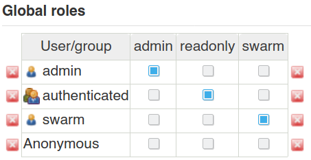

# Global Security Configuration

## Overview

### Authentication

Swarm may be used with either a [Jenkins API
token](https://www.jenkins.io/blog/2018/07/02/new-api-token-system/)
(recommended) or a password. The following command-line options control
authentication:

- `-username` The Jenkins username for authentication.
- `-password` The Jenkins user API token or password.
- `-passwordEnvVariable` Environment variable containing the Jenkins user API
  token or password.
- `-passwordFile` File containing the Jenkins user API token or password.

When using a password, the Swarm client will automatically obtain a valid
[CSRF crumb](https://support.cloudbees.com/hc/en-us/articles/219257077-CSRF-Protection-Explained)
when making requests.

### Authorization

Swarm requires a user with the following permissions:

- Overall/Read
- Agent/Create
- Agent/Connect
- Agent/Configure (_not_ required when using the project-based Matrix
  Authorization Strategy)

## Examples

### Matrix-based security

A common practice is to grant Overall/Read permission to either anonymous or
authenticated users, leaving the dedicated Swarm user with only Agent/Create,
Agent/Connect, and Agent/Configure permissions:

### Project-based Matrix Authorization Strategy

A common practice is to grant Overall/Read permission to either anonymous or
authenticated users, leaving the dedicated Swarm user with only Agent/Create
and Agent/Connect permissions:

Note that unlike matrix-based security, the project-based Matrix Authorization
Strategy does not require Agent/Configure permission.

### Role-Based Strategy

A common practice is to create a read-only role with Overall/Read permission,
leaving a dedicated Swarm role with only Agent/Create, Agent/Connect, and
Agent/Configure permissions:

The read-only role can then be assigned to either anonymous or authenticated
users, leaving the dedicated Swarm role for Swarm users only:

